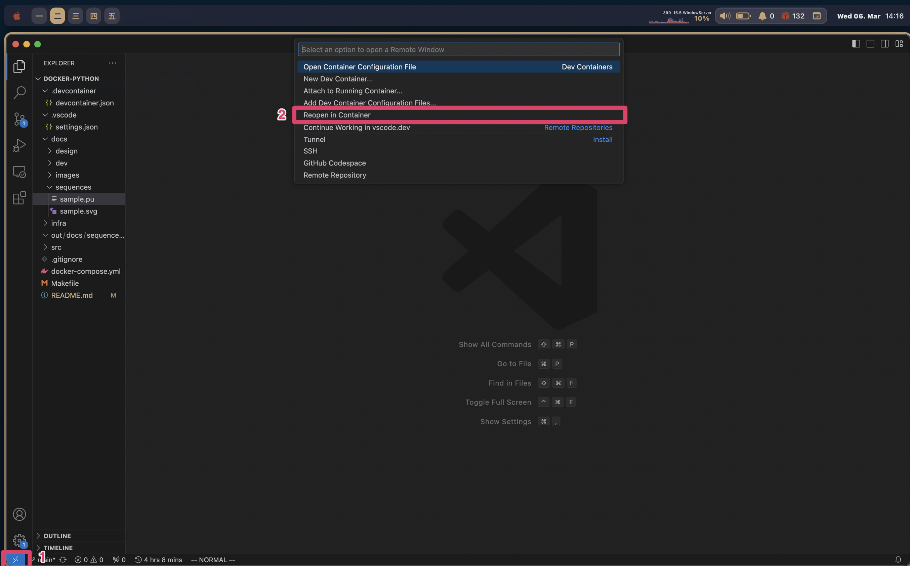
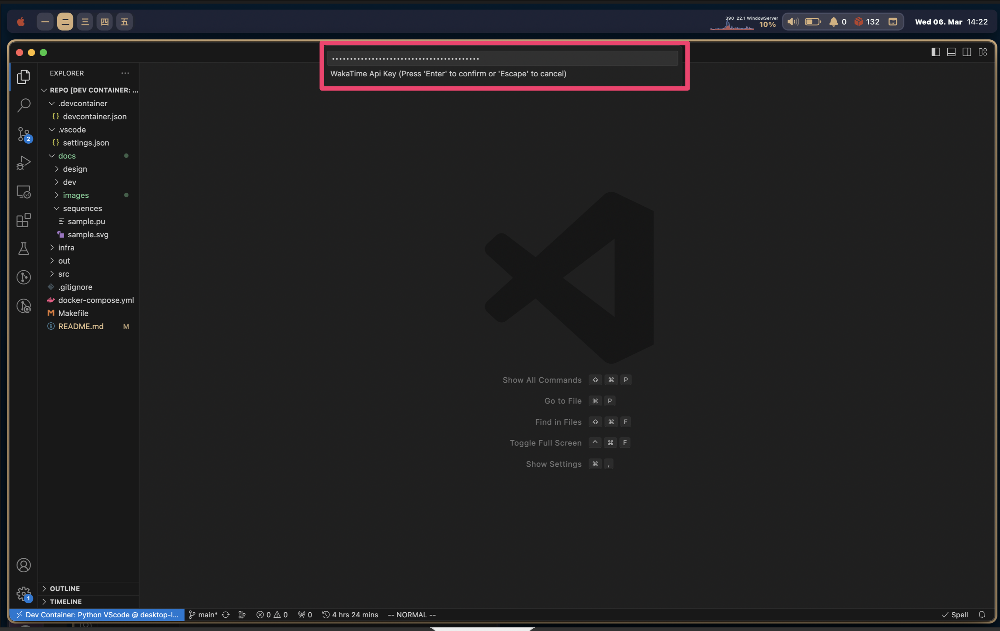

# docker-python-handson
This is a my own broiler template for python.
- [docker-python-handson](#docker-python-handson)
    - [docker commands](#docker-commands)
    - [start](#start)
    - [containers](#containers)
    - [vscode settings](#vscode-settings)

### docker commands
```bash
# run as production (docker-compose up -d --build)
$ make up
# run as develop (docker-compose -f docker-compose-dev.yml up -d --build)
$ make dev
# get into a container (docker-compose exec python bash)
$ make python
# down (docker-compose down)
$ make down
# destroy (docker-compose down --rmi all --volumes --remove-orphans)
$ make destroy
```

### start
1. run container
```bash
$ make up
```
2. reopen in container in vscode


3. set up [WakaTime](https://wakatime.com/) API key ([link](https://wakatime.com/settings/api-key))


4. copy `src/common/config/config.template.ini` to `src/common/config/config.ini`
```bash
cp src/common/config/config.template.ini src/common/config/config.ini
cp src/common/config/config.template.ini src/common/config/config.dev.ini
```

### containers
- python
  - python container to exec
- vscode
  - for dev containers in vscode
- plantuml
  - for sequences


### vscode settings
How do I press and hold a key and have it repeat in VSCode?
```bash
$ defaults write com.microsoft.VSCode ApplePressAndHoldEnabled -bool false
```


## Health Data Type

| データタイプ | 説明 |
|-------------|------|
| `HKCategoryTypeIdentifierAppleStandHour` | 1時間ごとに立ち上がったかどうかを記録 |
| `HKCategoryTypeIdentifierAudioExposureEvent` | 有害な音量レベルへの曝露イベントを記録 |
| `HKCategoryTypeIdentifierHandwashingEvent` | 手洗いイベントを検出・記録 |
| `HKCategoryTypeIdentifierMindfulSession` | マインドフルネスセッションの記録 |
| `HKCategoryTypeIdentifierSleepAnalysis` | 睡眠状態（浅い、深い、レムなど）の記録 |
| `HKDataTypeSleepDurationGoal` | 設定された睡眠時間の目標 |
| `HKQuantityTypeIdentifierActiveEnergyBurned` | 消費したアクティブエネルギー（カロリー） |
| `HKQuantityTypeIdentifierAppleExerciseTime` | 運動時間の記録（分単位） |
| `HKQuantityTypeIdentifierAppleStandTime` | 立っていた時間の合計（分単位） |
| `HKQuantityTypeIdentifierAppleWalkingSteadiness` | 歩行の安定性を評価するスコア |
| `HKQuantityTypeIdentifierBasalEnergyBurned` | 安静時のエネルギー消費量（カロリー） |
| `HKQuantityTypeIdentifierBodyFatPercentage` | 体脂肪率（%） |
| `HKQuantityTypeIdentifierBodyMass` | 体重（kg） |
| `HKQuantityTypeIdentifierBodyMassIndex` | BMI（体格指数） |
| `HKQuantityTypeIdentifierDistanceCycling` | サイクリングの距離（km） |
| `HKQuantityTypeIdentifierDistanceWalkingRunning` | 歩行およびランニングの距離（km） |
| `HKQuantityTypeIdentifierEnvironmentalAudioExposure` | 周囲の音量レベルへの曝露（dB） |
| `HKQuantityTypeIdentifierEnvironmentalSoundReduction` | 環境音の減少度合い |
| `HKQuantityTypeIdentifierFlightsClimbed` | 登った階数 |
| `HKQuantityTypeIdentifierHeadphoneAudioExposure` | ヘッドフォンの音量曝露（dB） |
| `HKQuantityTypeIdentifierHeartRate` | 心拍数（BPM） |
| `HKQuantityTypeIdentifierHeartRateRecoveryOneMinute` | 運動後1分間の心拍数回復量 |
| `HKQuantityTypeIdentifierHeartRateVariabilitySDNN` | 心拍変動（SDNN） |
| `HKQuantityTypeIdentifierHeight` | 身長（cm） |
| `HKQuantityTypeIdentifierLeanBodyMass` | 除脂肪体重（kg） |
| `HKQuantityTypeIdentifierPhysicalEffort` | 身体活動の強度 |
| `HKQuantityTypeIdentifierRespiratoryRate` | 呼吸数（回/分） |
| `HKQuantityTypeIdentifierRestingHeartRate` | 安静時心拍数（BPM） |
| `HKQuantityTypeIdentifierRunningGroundContactTime` | ランニング時の地面接触時間（ms） |
| `HKQuantityTypeIdentifierRunningPower` | ランニング時の出力（W） |
| `HKQuantityTypeIdentifierRunningSpeed` | ランニング速度（m/s） |
| `HKQuantityTypeIdentifierRunningStrideLength` | ランニングストライド長（m） |
| `HKQuantityTypeIdentifierRunningVerticalOscillation` | ランニング時の上下動（cm） |
| `HKQuantityTypeIdentifierSixMinuteWalkTestDistance` | 6分間歩行テストの距離（m） |
| `HKQuantityTypeIdentifierStairAscentSpeed` | 階段上昇速度（m/s） |
| `HKQuantityTypeIdentifierStairDescentSpeed` | 階段下降速度（m/s） |
| `HKQuantityTypeIdentifierStepCount` | 歩数（歩） |
| `HKQuantityTypeIdentifierTimeInDaylight` | 日光を浴びた時間（分） |
| `HKQuantityTypeIdentifierVO2Max` | 最大酸素摂取量（ml/kg/min） |
| `HKQuantityTypeIdentifierWalkingAsymmetryPercentage` | 歩行の左右非対称性（%） |
| `HKQuantityTypeIdentifierWalkingDoubleSupportPercentage` | 両足が地面に接している時間の割合（%） |
| `HKQuantityTypeIdentifierWalkingHeartRateAverage` | 歩行時の平均心拍数（BPM） |
| `HKQuantityTypeIdentifierWalkingSpeed` | 歩行速度（m/s） |
| `HKQuantityTypeIdentifierWalkingStepLength` | 歩幅（cm） |


## 共通のカラム
| カラム名 | データ型 | 説明 | データ例 |
|----------|---------|--------------------------------|----------------------------|
| sourceName | str | データを記録したデバイスまたはアプリの名前 | "my’s Apple Watch" |
| creationDate | datetime | データが記録された日時 (yyyy-mm-dd hh:mm:ss +h:00) | 2025-01-01 07:34:29 +0900 |
| startDate | datetime | 記録が開始された日時（該当する時間の開始） (yyyy-mm-dd hh:mm:ss +h:00) | 2025-01-01 07:00:00 +0900 |
| endDate | datetime | 記録が終了した日時（該当する時間の終了） (yyyy-mm-dd hh:mm:ss +h:00) | 2025-01-01 08:00:00 +0900 |
| duration | float | `startDate` と `endDate` の差分（秒単位の継続時間） | 3600.0 |

## HKCategoryTypeIdentifierAppleStandHour

**説明**
1時間ごとに立ち上がったかどうかを記録するデータタイプ。Apple Watchがユーザーのスタンド状態を検出し、時間ごとに記録する。

### 取得されるカラム
| value | int | スタンド状態を表すカテゴリ値（下記参照） | 1 |

### value のカテゴリ値
| カテゴリ値 | 数値 | 説明 |
|------------|------|--------------------------------|
| HKCategoryValueAppleStandHourIdle | 0 | その時間内に立ち上がらなかった（座ったままだった）ことを示す |
| HKCategoryValueAppleStandHourStood | 1 | その時間内に立ち上がったことを示す |

### RecordデータのXML形式
```xml
<Record type="HKCategoryTypeIdentifierAppleStandHour"
    sourceName="my’s Apple Watch"
    sourceVersion="10.6.1"
    device="<<HKDevice: 0x3035d0460>, name:Apple Watch, manufacturer:Apple Inc., model:Watch, hardware:Watch6,10, software:10.6.1, creation date:2024-08-24 17:12:03 +0000>"
    creationDate="2025-01-01 07:34:29 +0900"
    startDate="2025-01-01 07:00:00 +0900"
    endDate="2025-01-01 08:00:00 +0900"
    value="HKCategoryValueAppleStandHourStood">
</Record>
```


## HKCategoryTypeIdentifierAudioExposureEvent

**説明**
`HKCategoryTypeIdentifierAudioExposureEvent` は、環境音の一時的な高音量露出イベントを記録する HealthKit のカテゴリタイプです。Apple Watch によって記録され、一定の閾値を超えた環境音レベルを検出した際に記録されます。

### 取得されるカラム
| カラム名 | データ型 | 説明 | データ例 |
|------------|--------|--------------------------------|------------------|
| value | string | イベントの種類 | HKCategoryValueEnvironmentalAudioExposureEventMomentaryLimit |

### value のカテゴリ値
| カテゴリ値 | 説明 |
|--------------------------------|--------------------------------|
| HKCategoryValueEnvironmentalAudioExposureEventMomentaryLimit | 環境音の一時的な高音量露出イベントを示す |

### RecordデータのXML形式
```xml
<Record type="HKCategoryTypeIdentifierAudioExposureEvent" sourceName="my’s Apple Watch" sourceVersion="1" device="<<HKDevice: 0x3035d0fa0>, name:Apple Watch, manufacturer:Apple Inc., model:Watch, hardware:Watch6,10, software:10.6.1, creation date:2024-08-24 17:12:03 +0000>" creationDate="2025-01-03 12:46:46 +0900" startDate="2025-01-03 12:44:01 +0900" endDate="2025-01-03 12:46:46 +0900" value="HKCategoryValueEnvironmentalAudioExposureEventMomentaryLimit">
  <MetadataEntry key="HKMetadataKeyAudioExposureLevel" value="98.5993 dBASPL"/>
</Record>
```

### 備考
- 高音量（85dB以上）が長時間続くと聴覚に影響を与える可能性がある。
- Apple Watchは、短時間でも **有害な音量レベル（例: 100dB以上）** に達した場合、このイベントを記録する。


## HKCategoryTypeIdentifierHandwashingEvent

**説明**
`HKCategoryTypeIdentifierHandwashingEvent` は、手洗いイベントを記録する HealthKit のカテゴリタイプです。Apple Watch によって記録され、手洗いを検出した際に記録されます。

### 取得されるカラム

| カラム名  | データ型   | 説明      | データ例                     |
| ----- | ------ | ------- | ---------------------------- |
| value | string | イベントの種類 | HKCategoryValueNotApplicable |

### value のカテゴリ値

| カテゴリ値                          | 説明                           |
| ---------------------------- | ---------------------------- |
| HKCategoryValueNotApplicable | 手洗いイベントの特定のカテゴリ値が適用されないことを示す |

### RecordデータのXML形式

```xml
<Record type="HKCategoryTypeIdentifierHandwashingEvent" sourceName="my’s Apple Watch" sourceVersion="1112.5.1" creationDate="2025-01-01 18:22:46 +0900" startDate="2025-01-01 18:22:40 +0900" endDate="2025-01-01 18:22:46 +0900" value="HKCategoryValueNotApplicable">
</Record>
```


## HKCategoryTypeIdentifierMindfulSession

**説明**
`HKCategoryTypeIdentifierMindfulSession` は、マインドフルネスセッションの記録を行う HealthKit のカテゴリタイプです。Apple Watch やその他のアプリによって記録され、瞑想や呼吸セッションなどの実施をトラッキングします。

### 取得されるカラム

| カラム名  | データ型   | 説明      | データ例                     |
| ----- | ------ | ------- | ---------------------------- |
| value | string | イベントの種類 | HKCategoryValueNotApplicable |

### value のカテゴリ値

| カテゴリ値                          | 説明                           |
| ---------------------------- | ---------------------------- |
| HKCategoryValueNotApplicable | マインドフルネスセッションの特定のカテゴリ値が適用されないことを示す |

### RecordデータのXML形式

```xml
<Record type="HKCategoryTypeIdentifierMindfulSession" sourceName="my’s Apple Watch" sourceVersion="10.6.1" creationDate="2025-01-31 08:43:23 +0900" startDate="2025-01-31 08:38:20 +0900" endDate="2025-01-31 08:43:20 +0900" value="HKCategoryValueNotApplicable">
</Record>
```

## HKCategoryTypeIdentifierSleepAnalysis

### 説明
`HKCategoryTypeIdentifierSleepAnalysis` は、Appleのヘルスデータにおける睡眠の記録を表します。記録されたデータは、睡眠の開始時間と終了時間、および睡眠の状態（浅い睡眠、深い睡眠、覚醒など）を示します。

### 取得されるカラム

| カラム名 | データ型 | 説明 | データ例 |
|----------|---------|------|---------|
| value | String | 睡眠の状態を示すカテゴリ値 | `HKCategoryValueSleepAnalysisAsleepUnspecified` |

### value のカテゴリ値

| カテゴリ値 | 説明 |
|------------|------|
| HKCategoryValueSleepAnalysisInBed | ベッドにいる状態 |
| HKCategoryValueSleepAnalysisAsleepUnspecified | 指定なしの睡眠状態 |
| HKCategoryValueSleepAnalysisAwake | 覚醒状態 |
| HKCategoryValueSleepAnalysisAsleepCore | コア睡眠 |
| HKCategoryValueSleepAnalysisAsleepDeep | 深い睡眠 |
| HKCategoryValueSleepAnalysisAsleepREM | レム睡眠 |

### RecordデータのXML形式
```xml
<Record type="HKCategoryTypeIdentifierSleepAnalysis" sourceName="AutoSleep" sourceVersion="6.14.0" creationDate="2025-01-18 19:45:22 +0900" startDate="2025-01-18 06:59:00 +0900" endDate="2025-01-18 08:13:00 +0900" value="HKCategoryValueSleepAnalysisAsleepUnspecified">
</Record>
<Record type="HKCategoryTypeIdentifierSleepAnalysis" sourceName="my’s Apple Watch" sourceVersion="10.6.1" creationDate="2025-01-18 09:31:50 +0900" startDate="2025-01-18 08:03:53 +0900" endDate="2025-01-18 08:32:23 +0900" value="HKCategoryValueSleepAnalysisAsleepREM">
  <MetadataEntry key="HKTimeZone" value="Asia/Tokyo"/>
</Record>
<Record type="HKCategoryTypeIdentifierSleepAnalysis" sourceName="my’s Apple Watch" sourceVersion="10.6.1" creationDate="2025-01-18 09:31:50 +0900" startDate="2025-01-18 08:32:23 +0900" endDate="2025-01-18 09:12:53 +0900" value="HKCategoryValueSleepAnalysisAsleepCore">
  <MetadataEntry key="HKTimeZone" value="Asia/Tokyo"/>
</Record>
<Record type="HKCategoryTypeIdentifierSleepAnalysis" sourceName="my’s Apple Watch" sourceVersion="10.6.1" creationDate="2025-01-18 09:31:50 +0900" startDate="2025-01-18 06:40:23 +0900" endDate="2025-01-18 09:12:53 +0900" value="HKCategoryValueSleepAnalysisInBed">
  <MetadataEntry key="HKTimeZone" value="Asia/Tokyo"/>
</Record>
<Record type="HKCategoryTypeIdentifierSleepAnalysis" sourceName="my’s Apple Watch" sourceVersion="10.6.1" creationDate="2025-01-18 09:31:50 +0900" startDate="2025-01-18 09:12:53 +0900" endDate="2025-01-18 09:13:23 +0900" value="HKCategoryValueSleepAnalysisAwake">
  <MetadataEntry key="HKTimeZone" value="Asia/Tokyo"/>
</Record>
```

## HKQuantityTypeIdentifierActiveEnergyBurned

### 説明
`HKQuantityTypeIdentifierActiveEnergyBurned` は、Appleのヘルスデータにおいてアクティブエネルギー消費量（カロリー）を記録するデータタイプです。このデータは、運動や日常活動によって消費されたカロリー量を示します。

### 取得されるカラム

| カラム名  | データ型   | 説明            | データ例  |
|----------|---------|------------------|----------|
| value    | Double  | 消費カロリー（kcal）| `0.156`  |

### value のカテゴリ値

このデータタイプでは、`value` は消費されたカロリー量（kcal）として数値で記録されます。そのため、特定のカテゴリ値は存在しません。

### RecordデータのXML形式

```xml
<Record type="HKQuantityTypeIdentifierActiveEnergyBurned" sourceName="my’s Apple Watch" sourceVersion="10.6.1" device="<<HKDevice: 0x30378a210>, name:Apple Watch, manufacturer:Apple Inc., model:Watch, hardware:Watch6,10, software:10.6.1, creation date:2024-08-24 17:12:03 +0000>" unit="kcal" creationDate="2025-01-01 00:33:57 +0900" startDate="2025-01-01 00:20:30 +0900" endDate="2025-01-01 00:22:13 +0900" value="0.156">
</Record>
```

## HKQuantityTypeIdentifierAppleExerciseTime

### 説明
`HKQuantityTypeIdentifierAppleExerciseTime` は、Appleのヘルスデータにおいて運動時間（分）を記録するデータタイプです。このデータは、Apple Watch などのデバイスによって検出された運動の継続時間を示します。

### 取得されるカラム

| カラム名  | データ型   | 説明            | データ例  |
|----------|---------|------------------|----------|
| value    | Double  | 運動時間（分）    | `1`  |

### value のカテゴリ値

このデータタイプでは、`value` は運動時間（分）として数値で記録されます。そのため、特定のカテゴリ値は存在しません。

### RecordデータのXML形式

```xml
<Record type="HKQuantityTypeIdentifierAppleExerciseTime" sourceName="my’s Apple Watch" sourceVersion="10.6.1" device="<<HKDevice: 0x3034fe7b0>, name:Apple Watch, manufacturer:Apple Inc., model:Watch, hardware:Watch6,10, software:10.6.1, creation date:2024-08-24 17:12:03 +0000>" unit="min" creationDate="2025-01-01 01:19:12 +0900" startDate="2025-01-01 01:15:00 +0900" endDate="2025-01-01 01:16:00 +0900" value="1">
</Record>
```

## HKQuantityTypeIdentifierAppleStandTime

### 説明
`HKQuantityTypeIdentifierAppleStandTime` は、Appleのヘルスデータにおいて起立時間（分）を記録するデータタイプです。このデータは、Apple Watch などのデバイスによって検出されたスタンド時間を示します。

### 取得されるカラム

| カラム名  | データ型   | 説明            | データ例  |
|----------|---------|------------------|----------|
| value    | Double  | スタンド時間（分） | `1`  |

### value のカテゴリ値

このデータタイプでは、`value` はスタンド時間（分）として数値で記録されます。そのため、特定のカテゴリ値は存在しません。

### RecordデータのXML形式

```xml
<Record type="HKQuantityTypeIdentifierAppleStandTime" sourceName="my’s Apple Watch" sourceVersion="2890.16.23.1.1" unit="min" creationDate="2025-01-01 00:52:11 +0900" startDate="2025-01-01 00:45:00 +0900" endDate="2025-01-01 00:50:00 +0900" value="1">
</Record>
```

## HKQuantityTypeIdentifierAppleWalkingSteadiness

### 説明
`HKQuantityTypeIdentifierAppleWalkingSteadiness` は、Appleのヘルスデータにおいて歩行の安定性を記録するデータタイプです。このデータは、iPhone によって検出された歩行の安定性をパーセンテージ（%）で示します。

### 取得されるカラム

| カラム名  | データ型   | 説明                    | データ例  |
|----------|---------|--------------------------|----------|
| value    | Double  | 歩行の安定性（%）        | `0.97279`  |

### value のカテゴリ値

このデータタイプでは、`value` は歩行の安定性をパーセンテージ（%）として数値で記録されます。そのため、特定のカテゴリ値は存在しません。

### RecordデータのXML形式

```xml
<Record type="HKQuantityTypeIdentifierAppleWalkingSteadiness" sourceName="hellomyzn13" sourceVersion="2890.16.23" device="<<HKDevice: 0x3034fc320>, name:iPhone, manufacturer:Apple Inc., model:iPhone, hardware:iPhone16,1, software:17.6.1, creation date:2024-08-31 17:17:55 +0000>" unit="%" creationDate="2025-01-13 10:36:28 +0900" startDate="2025-01-06 09:00:00 +0900" endDate="2025-01-13 09:00:00 +0900" value="0.97279">
  <MetadataEntry key="HKAlgorithmVersion" value="2"/>
</Record>
```

## HKQuantityTypeIdentifierBasalEnergyBurned

### 説明
`HKQuantityTypeIdentifierBasalEnergyBurned` は、Appleのヘルスデータにおいて基礎代謝によるエネルギー消費量（カロリー）を記録するデータタイプです。このデータは、身体が安静時に消費するエネルギー量を示します。

### 取得されるカラム

| カラム名  | データ型   | 説明                    | データ例  |
|----------|---------|--------------------------|----------|
| value    | Double  | 基礎代謝による消費カロリー（kcal） | `17.354`  |

### value のカテゴリ値

このデータタイプでは、`value` は基礎代謝によるエネルギー消費量（kcal）として数値で記録されます。そのため、特定のカテゴリ値は存在しません。

### RecordデータのXML形式

```xml
<Record type="HKQuantityTypeIdentifierBasalEnergyBurned" sourceName="my’s Apple Watch" sourceVersion="10.6.1" device="<<HKDevice: 0x3037ea3a0>, name:Apple Watch, manufacturer:Apple Inc., model:Watch, hardware:Watch6,10, software:10.6.1, creation date:2024-08-24 17:12:03 +0000>" unit="kcal" creationDate="2025-01-01 00:23:55 +0900" startDate="2025-01-01 00:03:40 +0900" endDate="2025-01-01 00:20:30 +0900" value="17.354">
</Record>
```

## HKQuantityTypeIdentifierBodyFatPercentage

### 説明
`HKQuantityTypeIdentifierBodyFatPercentage` は、Appleのヘルスデータにおいて体脂肪率を記録するデータタイプです。このデータは、スマートスケールや他の測定デバイスを使用して測定された体脂肪率をパーセンテージ（%）で示します。

### 取得されるカラム

| カラム名  | データ型   | 説明                 | データ例  |
|----------|---------|---------------------|----------|
| value    | Double  | 体脂肪率（%）         | `0.162`  |

### value のカテゴリ値

このデータタイプでは、`value` は体脂肪率をパーセンテージ（%）として数値で記録されます。そのため、特定のカテゴリ値は存在しません。

### RecordデータのXML形式

```xml
<Record type="HKQuantityTypeIdentifierBodyFatPercentage" sourceName="eufy Life" sourceVersion="230" unit="%" creationDate="2025-01-30 08:52:53 +0900" startDate="2025-01-30 08:52:52 +0900" endDate="2025-01-30 08:52:52 +0900" value="0.162">
</Record>
```
